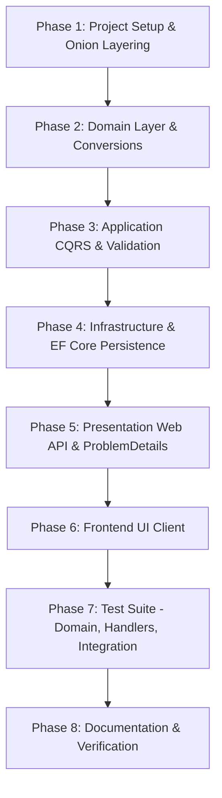

# Practical Test Xtramile - Project Architecture & Implementation Plan

> **Comprehensive Developer Guidance & Architectural Blueprint**


---

## 1. Executive Summary & Objective

Build a production-grade **ASP.NET Core (.NET 10) Web API** and a lightweight, responsive **front-end web client** for the Xtramile Practical Assessment.

### Core Capabilities
1. **Country & City Selection**: Cascading selection to browse supported locations.
2. **Current Weather Retrieval**: Fetches comprehensive weather metrics proxying OpenWeatherMap behind an `IWeatherService` abstraction, converting external Fahrenheit measurements to Celsius.
3. **State Mutation & Persistence**: Add custom weather notes / logs and manage favorite cities via CQRS commands persisted using **Entity Framework Core** (SQLite / In-Memory).
4. **Rigorous Offline Testing**: Automated testing across Domain, CQRS Handlers, and API Integration tests running **100% offline with zero live network calls**.
5. **Developer & AI Tooling**: Strict layer boundaries, MediatR pipelines, validation behaviors, and full project documentation.

---

## 2. Architecture & Design (Onion Architecture + CQRS)

The application strictly adheres to **Onion Architecture** and **CQRS (Command Query Responsibility Segregation)** via **MediatR**:

```
                  ┌──────────────────────────────────────────────┐
                  │                 Presentation                 │
                  │   (Controllers / Minimal APIs / Middleware)  │
                  └──────────────────────┬───────────────────────┘
                                         ▼
                  ┌──────────────────────────────────────────────┐
                  │                 Application                  │
                  │  (CQRS Commands/Queries, Handlers, DTOs,     │
                  │   Behaviors, FluentValidation, Interfaces)   │
                  └──────────────────────┬───────────────────────┘
                                         ▼
                  ┌──────────────────────────────────────────────┐
                  │                    Domain                    │
                  │  (Entities, Value Objects, Domain Rules,     │
                  │   TemperatureConverter, Domain Exceptions)   │
                  └──────────────────────────────────────────────┘
                                         ▲
                  ┌──────────────────────┴───────────────────────┐
                  │                Infrastructure                │
                  │  (EF Core DbContext, WeatherService Client,  │
                  │   Mock Providers, Migrations / Seeders)      │
                  └──────────────────────┴───────────────────────┘
```

### Layer Responsibilities & Dependency Rules

1. **Domain Layer (Core)**:
   - Zero framework dependencies (no EF Core, no ASP.NET, no MediatR).
   - Holds core entities (`WeatherNote`, `FavoriteCity`, `Country`, `City`).
   - Encapsulates domain logic & rules: `TemperatureConverter` (Fahrenheit to Celsius conversion & rounding).
2. **Application Layer**:
   - Depends **only** on the Domain layer.
   - Defines CQRS Requests (`IRequest<TResponse>`), Commands, Queries, and Handlers.
   - DTOs & Mappings.
   - Validation via **FluentValidation** integrated through a MediatR `ValidationBehavior` pipeline.
   - Abstractions & Contracts: `IApplicationDbContext`, `IWeatherService`, `IDateTimeProvider`.
3. **Infrastructure Layer**:
   - Implements abstractions defined in the Application layer.
   - EF Core `ApplicationDbContext` (SQLite / In-Memory provider).
   - Entity Configurations (`IEntityTypeConfiguration<T>`).
   - Seeding for master countries and cities.
   - External HTTP Client integration: `OpenWeatherMapService` with `IHttpClientFactory` and resilient fallback `MockWeatherService` for offline execution.
4. **Presentation / API Layer**:
   - Thin ASP.NET Core Web API controllers.
   - Dispatches requests directly to MediatR via `ISender`.
   - Global exception handling producing RFC 9110 compliant `ProblemDetails` / `ValidationProblemDetails`.
   - CORS policy configuration and OpenAPI / Swagger documentation.
5. **Client / Front-End**:
   - Lightweight, accessible, modern web client (HTML5, CSS, Vanilla JS / SPA) served via `wwwroot` or standalone dev server.
   - Country dropdown → City dropdown → Weather Card → Save Note / Favorite form.

---

## 3. Solution Layout & File Structure

```
Practical Test Xtramile/
├── Practical Test Xtramile.slnx               # Solution file
├── GEMINI.md                                  # Architectural plan & AI developer instructions
├── README.md                                  # Project documentation, setup & testing guide
│
├── src/
│   └── Practical_Test_Xtramile/               # ASP.NET Core Web API Host & Onion Layers
│       ├── Practical_Test_Xtramile.csproj
│       ├── Program.cs                         # Composition Root & HTTP pipeline
│       ├── appsettings.json                   # Configuration (OpenWeatherMap, Provider)
│       ├── appsettings.Development.json
│       │
│       ├── Domain/                            # [Domain Layer] - Zero external dependencies
│       │   ├── Common/
│       │   │   ├── BaseEntity.cs
│       │   │   └── Result.cs                  # Operation result wrapper
│       │   ├── Entities/
│       │   │   ├── Country.cs
│       │   │   ├── City.cs
│       │   │   ├── WeatherNote.cs
│       │   │   └── FavoriteCity.cs
│       │   ├── ValueObjects/
│       │   │   ├── Temperature.cs             # Encapsulates F & C with conversion logic
│       │   │   └── WindInfo.cs                # Speed & Direction
│       │   └── Services/
│       │       └── TemperatureConverter.cs    # Pure domain calculation rules
│       │
│       ├── Application/                       # [Application Layer] - CQRS & Contracts
│       │   ├── Common/
│       │   │   ├── Behaviors/
│       │   │   │   ├── ValidationBehavior.cs  # MediatR pipeline validation
│       │   │   │   └── LoggingBehavior.cs     # Request execution logging
│       │   ├── Exceptions/
│       │   │   ├── ValidationException.cs
│       │   │   └── NotFoundException.cs
│       │   └── Interfaces/
│       │       ├── IApplicationDbContext.cs
│       │       ├── IWeatherService.cs
│       │       └── IDateTimeProvider.cs
│       ├── Features/
│       │   ├── Countries/
│       │   │   ├── Queries/
│       │   │   │   ├── GetCountriesQuery.cs
│       │   │   │   ├── GetCountriesQueryHandler.cs
│       │   │   │   ├── GetCitiesByCountryQuery.cs
│       │   │   │   └── GetCitiesByCountryQueryHandler.cs
│       │   │   └── DTOs/
│       │   │       ├── CountryDto.cs
│       │   │       └── CityDto.cs
│       │   ├── Weather/
│       │   │   ├── Queries/
│       │   │   │   ├── GetWeatherByCityQuery.cs
│       │   │   │   └── GetWeatherByCityQueryHandler.cs
│       │   │   ├── Commands/
│       │   │   │   ├── CreateWeatherNoteCommand.cs
│       │   │   │   ├── CreateWeatherNoteCommandHandler.cs
│       │   │   │   ├── CreateWeatherNoteValidator.cs
│       │   │   │   ├── SaveFavoriteCityCommand.cs
│       │   │   │   ├── SaveFavoriteCityCommandHandler.cs
│       │   │   │   └── SaveFavoriteCityValidator.cs
│       │   │   └── DTOs/
│       │   │       ├── WeatherResponseDto.cs
│       │   │       ├── WeatherNoteDto.cs
│       │   │       └── FavoriteCityDto.cs
│       │
│       ├── Infrastructure/                    # [Infrastructure Layer] - External concerns
│       │   ├── Persistence/
│       │   │   ├── ApplicationDbContext.cs
│       │   │   ├── Configurations/
│       │   │   │   ├── CountryConfiguration.cs
│       │   │   │   ├── CityConfiguration.cs
│       │   │   │   ├── WeatherNoteConfiguration.cs
│       │   │   │   └── FavoriteCityConfiguration.cs
│       │   │   └── Seed/
│       │   │       └── MasterDataSeeder.cs    # Seeds Countries & Cities
│       │   ├── WeatherApi/
│       │   │   ├── OpenWeatherMapSettings.cs
│       │   │   ├── OpenWeatherMapService.cs   # HTTP Client implementation
│       │   │   ├── MockWeatherService.cs      # Offline fallback / test implementation
│       │   │   └── Models/
│       │   │       └── OpenWeatherRawResponse.cs
│       │   └── Services/
│       │       └── DateTimeProvider.cs
│       │
│       ├── Presentation/                      # [Presentation / API Layer]
│       │   ├── Controllers/
│       │   │   ├── ApiControllerBase.cs
│       │   │   ├── CountriesController.cs     # /api/countries endpoints
│       │   │   └── WeatherController.cs       # /api/weather & notes endpoints
│       │   └── Middleware/
│       │       └── ExceptionHandlingMiddleware.cs # ProblemDetails formatter
│       │
│       └── wwwroot/                           # [Frontend Client]
│           ├── index.html                     # Responsive UI layout
│           ├── css/
│           │   └── styles.css                 # Curated, modern typography & design system
│           └── js/
│               └── app.js                     # Country/City cascading, API fetch, UI mutations
│
└── tests/
    └── Practical_Test_Xtramile.Tests/         # [Automated Test Suite]
        ├── Practical_Test_Xtramile.Tests.csproj
        ├── UnitTests/
        │   ├── Domain/
        │   │   └── TemperatureConverterTests.cs # Freezing, boiling, negative edge cases
        │   └── Application/
        │       ├── Queries/
        │       │   └── GetWeatherByCityQueryHandlerTests.cs # Mocked dependencies
        │       └── Commands/
        │           └── CreateWeatherNoteCommandHandlerTests.cs # EF Core state mutations
        └── IntegrationTests/
            ├── TestWebApplicationFactory.cs   # Offline in-memory test server
            ├── MockHttpMessageHandler.cs      # Zero network calls guarantee
            └── ApiEndpointTests.cs            # End-to-end integration tests
```

---

## 4. Architectural Rules & Invariants (Do Not Violate)

1. **Strict Layer Boundary Isolation**:
   - **Domain** references nothing outside itself. Zero NuGet packages for frameworks or databases.
   - **Application** references Domain only. Contains no SQL, EF Core DbContext, or HTTP Client specifics.
   - **Infrastructure** references Application and Domain. Implements interfaces (`IApplicationDbContext`, `IWeatherService`).
   - **API (Host)** wires dependencies and routes incoming requests to MediatR handlers.
2. **CQRS Decoupling**:
   - Controllers never perform direct database operations or call third-party HTTP APIs.
   - All HTTP actions dispatch an `IRequest<TResponse>` via MediatR (`ISender.Send()`).
   - Queries handle reads; Commands handle writes/mutations.
3. **Read Optimization**:
   - **Mandatory**: All read queries executed via EF Core must explicitly use `.AsNoTracking()` to avoid unnecessary change tracker overhead.
4. **State Persistence**:
   - Commands must commit state changes via `IApplicationDbContext.SaveChangesAsync()`.
   - Creation commands return a `201 Created` status with the newly generated identifier (e.g., `Guid` or `int`).
5. **Weather Abstraction & Offline Guarantee**:
   - External weather API calls are strictly encapsulated behind `IWeatherService`.
   - The test suite and local environment must support offline execution via `MockWeatherService` or mocked HTTP handlers. **Automated tests must never make live calls over the internet.**

---

## 5. Domain Logic & Weather Specifications

### Temperature Unit Conversion Rules
External weather APIs (e.g., OpenWeatherMap Imperial units) provide temperature in **Fahrenheit**. The system must convert Fahrenheit metrics to **Celsius**:

$$\text{Celsius} = (\text{Fahrenheit} - 32) \times \frac{5}{9}$$

- **Rounding Standard**: Rounded to 2 decimal places using `Math.Round(val, 2, MidpointRounding.AwayFromZero)`.
- **Edge Cases Tested in Domain Unit Tests**:
  - Boiling Point: $212.0^\circ\text{F} \rightarrow 100.0^\circ\text{C}$
  - Freezing Point: $32.0^\circ\text{F} \rightarrow 0.0^\circ\text{C}$
  - Body Temperature: $98.6^\circ\text{F} \rightarrow 37.0^\circ\text{C}$
  - Absolute Zero: $-459.67^\circ\text{F} \rightarrow -273.15^\circ\text{C}$
  - Crossover Point: $-40.0^\circ\text{F} \rightarrow -40.0^\circ\text{C}$
  - Zero Fahrenheit: $0.0^\circ\text{F} \rightarrow -17.78^\circ\text{C}$

### Complete Weather Payload Structure (`WeatherResponseDto`)
The weather endpoint must return the following fields:
```json
{
  "location": {
    "city": "Melbourne",
    "country": "Australia",
    "countryCode": "AU"
  },
  "timeUtc": "2026-09-16T02:45:00Z",
  "wind": {
    "speedMph": 12.5,
    "directionDegrees": 180,
    "directionCardinal": "S"
  },
  "visibilityMeters": 10000,
  "pressureHpa": 1013.25,
  "skyConditions": "Clear",
  "temperature": {
    "fahrenheit": 68.0,
    "celsius": 20.0
  },
  "dewPoint": {
    "fahrenheit": 50.0,
    "celsius": 10.0
  },
  "relativeHumidityPercent": 55
}
```

> **Dew Point Calculation**: When external APIs do not supply dew point directly, approximate using the Magnus-Tetens formula:
> $$T_d \approx T - \left(\frac{100 - RH}{5}\right)$$ (or NOAA approximation from temperature and relative humidity).

---

## 6. Functional API Specifications

### Queries (Read Side)

#### 1. Get All Countries
- **Endpoint**: `GET /api/countries`
- **MediatR**: `GetCountriesQuery` $\rightarrow$ `IReadOnlyList<CountryDto>`
- **EF Core Rule**: Explicit `.AsNoTracking()`
- **Response**: `200 OK`
```json
[
  { "id": 1, "code": "AU", "name": "Australia" },
  { "id": 2, "code": "US", "name": "United States" },
  { "id": 3, "code": "ID", "name": "Indonesia" }
]
```

#### 2. Get Cities by Country Code
- **Endpoint**: `GET /api/countries/{countryCode}/cities`
- **MediatR**: `GetCitiesByCountryQuery(countryCode)` $\rightarrow$ `IReadOnlyList<CityDto>`
- **EF Core Rule**: Explicit `.AsNoTracking()`
- **Response**: `200 OK` (or `404 Not Found` if country does not exist)
```json
[
  { "id": 101, "name": "Melbourne", "countryCode": "AU" },
  { "id": 102, "name": "Sydney", "countryCode": "AU" }
]
```

#### 3. Get Weather by City Name
- **Endpoint**: `GET /api/weather/{cityName}`
- **MediatR**: `GetWeatherByCityQuery(cityName)` $\rightarrow$ `WeatherResponseDto`
- **Service**: Delegates to `IWeatherService.GetCurrentWeatherAsync(cityName, ct)`
- **Conversion**: Converts raw Fahrenheit input into Celsius via `TemperatureConverter`.
- **Response**: `200 OK` (or `404 Not Found` if city weather unavailable)

---

### Commands (Write Side)

#### 1. Save Custom Weather Note / Log
- **Endpoint**: `POST /api/weather/notes`
- **MediatR**: `CreateWeatherNoteCommand`
- **Validation**: FluentValidation (City name required, Note non-empty, Max length 500 chars).
- **Request Payload**:
```json
{
  "cityName": "Melbourne",
  "note": "Windy afternoon, optimal for indoor review.",
  "temperatureCelsius": 20.0,
  "skyConditions": "Clear"
}
```
- **Response**: `201 Created`
```json
{
  "id": "3fa85f64-5717-4562-b3fc-2c963f66afa6",
  "cityName": "Melbourne",
  "note": "Windy afternoon, optimal for indoor review.",
  "createdAtUtc": "2026-09-16T02:46:00Z"
}
```

#### 2. Save Favorite City
- **Endpoint**: `POST /api/cities/favorites` (or `POST /api/weather/favorites`)
- **MediatR**: `SaveFavoriteCityCommand`
- **Validation**: City name required, prevents duplicate favorites.
- **Request Payload**:
```json
{
  "cityName": "Sydney",
  "countryCode": "AU"
}
```
- **Response**: `201 Created` with resource ID.

---

## 7. Persistence & Data Seeding (EF Core)

- **Provider**: SQLite (persisted to `App_Data/weather.db` or In-Memory for test isolation).
- **Entities**:
  - `Country` (`Id`, `Code` [UK, 2-char], `Name`).
  - `City` (`Id`, `CountryId`, `Name`, FK $\rightarrow$ `Country`).
  - `WeatherNote` (`Id` [Guid], `CityName`, `Note`, `TemperatureCelsius`, `SkyConditions`, `CreatedAtUtc`).
  - `FavoriteCity` (`Id` [Guid], `CityName`, `CountryCode`, `CreatedAtUtc`).
- **Seeding & Environment Gating (`MasterDataSeeder`)**:
  - Countries: Australia (`AU`), United States (`US`), Indonesia (`ID`), United Kingdom (`GB`), Japan (`JP`).
  - Cities:
    - Australia: Melbourne, Sydney, Brisbane, Perth.
    - United States: New York, San Francisco, Chicago, Seattle.
    - Indonesia: Jakarta, Surabaya, Bandung, Bali.
    - United Kingdom: London, Manchester, Edinburgh.
    - Japan: Tokyo, Osaka, Kyoto.
  - **Environment & Configuration Validation**:
    - Controlled by `Database:SeedData` boolean flag in configuration.
    - Defaults to `true` in **Development** and **Testing** (integration test suite).
    - Defaults to `false` in **Production** (`appsettings.json`) to prevent horizontal race conditions and preserve DBA schema authority.
    - Checked via:
      ```csharp
      bool shouldSeed = config.GetValue<bool>(
          "Database:SeedData", 
          defaultValue: env.IsDevelopment() || env.IsEnvironment("Testing")
      );
      if (shouldSeed)
      {
          await MasterDataSeeder.SeedAsync(context);
      }
      ```
    - Idempotent: Skips execution if `context.Countries.AnyAsync()` is already true.

---

## 8. Front-End Web Client Specification

A lightweight, premium user interface served directly by ASP.NET Core (`wwwroot/index.html`):

### UI Components & Aesthetics
- **Design System**: Inter / Outfit typography, sleek dark/light card aesthetics, CSS variables, glassmorphism accents, subtle micro-transitions.
- **Workflow**:
  1. **Country Dropdown**: Loads dynamically from `GET /api/countries`.
  2. **City Dropdown**: Disabled until a country is chosen. Loads from `GET /api/countries/{code}/cities`.
  3. **Weather Card**:
     - Automatically renders when a city is selected.
     - Displays: City & Country, UTC Time, Weather Condition Icon & Text, Dual Temperatures ($^\circ\text{C}$ prominently, $^\circ\text{F}$ secondary), Wind Speed & Direction, Pressure, Visibility, Humidity, Dew Point.
  4. **Save Note / Favorite Action**:
     - Note input text box with "Save Weather Note" button.
     - "Add to Favorites" button with visual feedback (heart badge / toast notification).
     - Dispatches `POST /api/weather/notes` or `POST /api/cities/favorites`.
     - Displays real-time confirmation message with returned ID.

---

## 9. Automated Testing Strategy (100% Offline Constraint)

### Test Project: `Practical_Test_Xtramile.Tests`

| Test Category | Target Component | Method & Scope |
| :--- | :--- | :--- |
| **Domain Unit Tests** | `TemperatureConverter` | Validates formula against Freezing (32°F $\rightarrow$ 0°C), Boiling (212°F $\rightarrow$ 100°C), Negative crossover (-40°F $\rightarrow$ -40°C), Sub-zero, and precision rounding. |
| **Query Handler Unit Tests** | `GetWeatherByCityQueryHandler` | Mocked `IWeatherService` returning fixed Fahrenheit metrics; asserts handler maps DTO and executes conversion correctly without network calls. |
| **Command Handler Unit Tests** | `CreateWeatherNoteCommandHandler` | Executes handler against an isolated EF Core In-Memory database instance; verifies record insertion, generated Guid, and state mutation. |
| **API Integration Tests** | Full Web API Pipeline | Uses `WebApplicationFactory<Program>`, swaps `IWeatherService` with `MockWeatherService` or registers a `MockHttpMessageHandler`; tests HTTP status codes (`200`, `201`, `400`, `404`) offline. |

### Offline Constraint Enforcement
- `MockHttpMessageHandler` intercepts `HttpClient` requests and returns canned OpenWeatherMap JSON responses.
- `MockWeatherService` provides deterministic responses when running in test / demo mode.
- Under no circumstances does `dotnet test` make an outbound TCP/HTTP socket connection.

---

## 10. Developer AI Tooling & Context Configuration

To satisfy **Section 5 of Document.md**, this project includes contextual AI rules:

- **Primary AI Context File**:
  - `GEMINI.md` (this file): Canonical implementation blueprint, domain rules, operational commands, layer boundaries, and AI assistant guidelines.
- **Rules Enforced**:
  - Onion Architecture: Strictly no inward framework contamination into Domain.
  - CQRS: MediatR handlers must stay small, cohesive, and single-purpose.
  - EF Core: Queries must use `.AsNoTracking()`.
  - Offline first: Never introduce live API calls into unit/integration test suites.

---

## 11. Phased Step-by-Step Implementation Roadmap



### Phase 1: Project Setup & Package Configuration
- Update `Practical_Test_Xtramile.csproj` with necessary packages:
  - `MediatR`
  - `FluentValidation.AspNetCore`
  - `Microsoft.EntityFrameworkCore.Sqlite` & `Microsoft.EntityFrameworkCore.InMemory`
  - `Microsoft.AspNetCore.OpenApi`
- Create Onion Architecture folder structure (`Domain/`, `Application/`, `Infrastructure/`, `Presentation/`).

### Phase 2: Domain Layer
- Implement `BaseEntity`, `Result`, and core entities: `Country`, `City`, `WeatherNote`, `FavoriteCity`.
- Implement `ValueObjects`: `Temperature` and `WindInfo`.
- Implement `TemperatureConverter` with exact conversion and rounding logic.

### Phase 3: Application Layer
- Configure MediatR requests, DTOs, and pipeline behaviors (`ValidationBehavior`).
- Implement Queries:
  - `GetCountriesQuery` + Handler.
  - `GetCitiesByCountryQuery` + Handler.
  - `GetWeatherByCityQuery` + Handler.
- Implement Commands:
  - `CreateWeatherNoteCommand` + Handler + FluentValidator.
  - `SaveFavoriteCityCommand` + Handler + FluentValidator.
- Define abstractions: `IApplicationDbContext`, `IWeatherService`.

### Phase 4: Infrastructure Layer
- Implement `ApplicationDbContext` with EF Core entity configurations.
- Create `MasterDataSeeder` for countries and cities.
- Implement `OpenWeatherMapService` with resilient HTTP client and `MockWeatherService` for offline/fallback mode.

### Phase 5: Presentation / API Layer
- Implement `CountriesController` (`/api/countries`, `/api/countries/{code}/cities`).
- Implement `WeatherController` (`/api/weather/{city}`, `/api/weather/notes`, `/api/cities/favorites`).
- Configure global error handling producing RFC 9110 `ProblemDetails`.
- Enable CORS and static file serving (`app.UseStaticFiles()`, `app.UseDefaultFiles()`).

### Phase 6: Front-End Application
- Create `wwwroot/index.html`, `wwwroot/css/styles.css`, and `wwwroot/js/app.js`.
- Connect cascading Country → City dropdowns.
- Render responsive weather metrics card.
- Wire Note/Favorite submission form with visual confirmation.

### Phase 7: Automated Test Suite
- Create test project `tests/Practical_Test_Xtramile.Tests`.
- Domain unit tests for `TemperatureConverter` (edge cases).
- CQRS query and command handler unit tests (mocked dependencies + In-Memory EF Core).
- Offline integration tests using `WebApplicationFactory`.

### Phase 8: Documentation & Deliverables
- Generate `README.md` with:
  - Architecture overview (Onion + CQRS decoupling).
  - Setup, build, run, and test commands.
  - EF Core state management notes and AI tooling setup notes.

---

## 12. Verification & Build Commands

```bash
# Build the entire solution
dotnet build "Practical Test Xtramile.slnx"

# Run the Web API and Frontend host
dotnet run --project "Practical Test Xtramile/Practical Test Xtramile.csproj"

# Run all automated tests (strictly offline)
dotnet test "tests/Practical_Test_Xtramile.Tests/Practical_Test_Xtramile.Tests.csproj"
```

- **OpenAPI Document**: `http://localhost:5000/openapi/v1.json`
- **Web Client UI**: `http://localhost:5000/index.html` (or `https://localhost:5001/index.html`)
